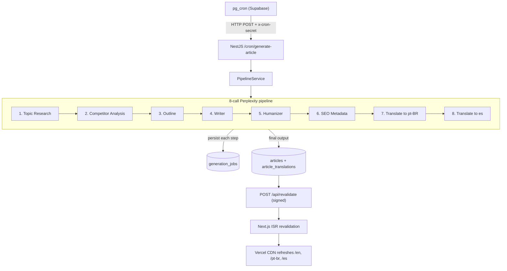

# Tech Stack — AI & Tech Blog

## Overview

A mobile-first, SEO-optimized AI & Tech blog built to rank fast in Google and monetize through Google AdSense. Articles are generated, humanized, and translated automatically by an 8-call Perplexity pipeline triggered by a cron schedule (4×/week), persisted to Postgres, and published to a statically-rendered Next.js frontend via on-demand ISR. All generation logic is owned by our own backend — no third-party workflow platforms.

Deliverable of this document: the complete, opinionated set of technology choices we commit to before scaffolding.

## Project type

Nx monorepo containing two deployable applications (Next.js public site, NestJS backend API) plus shared libraries. Production web app + scheduled content-generation service.

## Codebase context

- `.cursor/rules/` already defines the expected architecture: Nx monorepo with enforced project boundaries (`nx-architecture.mdc`, `nx-boundaries.mdc`, `nx-react.mdc`, `nx-core.mdc`, `nestjs-guidelines.mdc`, `drizzle-guidelines.mdc`, `typescript-guidelines.mdc`).
- `docs/product_idea.md` defines SEO, content, and AdSense requirements.
- `docs/built-article-steps.md` defines the 8 sequential Perplexity calls the backend must orchestrate.
- [`docs/seo-geo.md`](seo-geo.md) is the source of truth for SEO and Generative Engine Optimization (GEO) policy, including the AI crawler allow/block list.
- [`docs/accessibility.md`](accessibility.md) is the source of truth for WCAG 2.2 AA compliance, tooling, and testing layers.

## Success criteria

- Core Web Vitals on mobile: LCP < 2.5s, INP < 200ms, CLS < 0.1 across every article page.
- First-load JavaScript on a public article page: < 90 KB gzip.
- Lighthouse (mobile) Performance ≥ 90.
- SEO and GEO success criteria: see [`docs/seo-geo.md`](seo-geo.md).
- Accessibility success criteria (WCAG 2.2 AA, Lighthouse a11y ≥ 95): see [`docs/accessibility.md`](accessibility.md).
- Cron runs ≥ 4×/week, generates + humanizes + translates an article end-to-end, writes it to the DB, and triggers ISR revalidation automatically.
- All mandatory AdSense pages published before submission.

## Tech stack

### Monorepo and tooling

- **Nx** (workspace, task graph, caching, project boundaries)
- **pnpm** (package manager and workspaces)
- **TypeScript** (strict mode, project references)
- **ESLint** + **Prettier**
- **Vitest** (unit tests)
- **Playwright** (e2e smoke tests)
- **Lighthouse CI** (CWV gate in PRs)
- **Husky** + **lint-staged** (pre-commit)
- **Commitlint** + Conventional Commits

### Frontend — `apps/web`

- **Next.js 16.2.4** (App Router, React Server Components, ISR, Turbopack default bundler, Stable Adapters API)
- **React 19.2** (React Compiler enabled)
- **Tailwind CSS v4** (design tokens declared in CSS via `@theme`)
- **class-variance-authority (CVA)** + **clsx** + **tailwind-merge** (typed component variants)
- **Radix UI primitives** — accessible foundations for `libs/ui`; see [`docs/accessibility.md`](accessibility.md).
- **Custom component library** in `libs/ui` — hand-built from AI-generated designs (v0, Stitch, Lovable, Claude, Figma Make). No shadcn/ui, no Headless UI, no Mantine, no Chakra.
- **Lucide React** (icons, tree-shakeable)
- **Framer Motion** (opt-in, per-page)
- **next-intl** (v16-compatible release — i18n, routing, `hreflang`, `x-default`)
- **next/image** and **next/font** (built-in)
- Native Next.js primitives for SEO/GEO output (`app/sitemap.ts`, `app/robots.ts`, `generateMetadata`, `llms.txt`, `llms-full.txt`, RSS/Atom feeds, and in-page JSON-LD helpers from `libs/seo`). See [`docs/seo-geo.md`](seo-geo.md).
- **react-hook-form** + **zod** (forms: contact, newsletter, admin)

### Backend — `apps/api`

- **NestJS 11.1.x** (HTTP API, modules per pipeline step)
- **Drizzle ORM** (latest) over Supabase Postgres — SQL-first, zero-runtime-codegen, no query engine binary (chosen over Prisma to minimize Fly.io cold-start weight and to stay close to Postgres-native features like `tsvector`, `pg_trgm`, and RLS)
- **postgres.js** (`postgres` package) — Drizzle's recommended Node.js Postgres driver
- **drizzle-kit** (schema introspection, migration generation, `drizzle-studio` for local inspection)
- **Zod** (input validation on DTOs and Perplexity responses)
- **class-validator** + **class-transformer** (NestJS DTO layer)
- **Helmet** (security headers)
- **@nestjs/throttler** (rate limiting on public and cron endpoints)
- **Pino** (structured logging)
- **p-retry** (retry with backoff inside the Perplexity pipeline)
- **BullMQ** — deferred; introduced only if/when the pipeline needs background queueing beyond the synchronous long-running request model.

### Data layer

- **Supabase Postgres** (primary data store — articles, translations, categories, tags, authors, generation jobs, newsletter subscribers, analytics snapshots)
- **Supabase Auth** (admin dashboard login only; public site is anonymous)
- **Supabase Storage** (article cover images and OG images)
- **Postgres full-text search** (`tsvector` + `pg_trgm`) for in-site search
- **Supabase `pg_cron`** + `net.http_post` as the primary cron trigger (alternate: GitHub Actions scheduled workflow; fallback: cron-job.org)
- **Row Level Security** on admin-scoped tables

### AI / content generation

- **Perplexity API** — model `sonar-pro` (8-call pipeline defined in `docs/built-article-steps.md`)
- Prompt definitions centralized in `libs/prompts` as typed functions, one per pipeline step.

### Hosting and deployment

- **Vercel** (Next.js web app — ISR, Image Optimization, Edge Network)
- **Fly.io Pay As You Go** (NestJS API) — committed host for `apps/api`.
  - Machine preset: `shared-cpu-1x` with 512 MB RAM (ample headroom for Drizzle + postgres.js, the 8-call Perplexity pipeline, and `p-retry` — no Prisma query engine binary to load).
  - Scale-to-zero enabled: `auto_stop_machines = "stop"` and `min_machines_running = 0` in `fly.toml` (suspend on idle, wake on incoming request, ~300–800 ms cold start — acceptable because cron and admin traffic tolerate it).
  - Region: single NA/EU region at launch; global anycast included for future multi-region.
  - Secrets via `fly secrets`; HTTPS + managed Let's Encrypt certificate (first 10 single-host certs free).
  - **Budget alert**: configure a Fly.io monthly spend alert at ~$10 to cap runaway runtime or egress from the Perplexity pipeline.
  - Expected monthly bill: **$1–3/mo** (idle + ~10–20 h/mo of active pipeline runtime + minimal egress at $0.02/GB NA/EU).
- **Supabase Cloud** (Postgres + Auth + Storage + pg_cron)

### Email

- **Resend** (transactional + newsletter sends)
- Double opt-in flow with confirmation tokens stored in Supabase

### SEO, analytics, consent, ads

Vendors committed: Google Search Console, Google Analytics 4, Google AdSense, a Google-certified CMP (Funding Choices or equivalent), and optionally Vercel Analytics / Speed Insights. All policy, configuration, and GEO strategy live in [`docs/seo-geo.md`](seo-geo.md).

### Observability

- **Sentry** (web + api)
- **Logtail** or **Axiom** (API log aggregation — final choice in the ops task)

### Security

- Shared-secret header (`x-cron-secret`) + IP allowlist on `/cron/*` endpoints
- HTTPS-only (enforced by Vercel and Fly.io platforms)
- Helmet, CORS allowlist, strict CSP on the API
- Environment variables via Vercel and Fly.io secrets; never committed
- Revalidation token signed and shared between API and Next.js

## File structure

```
apps/
  web/                 Next.js 16.2 — public blog + admin UI (route group)
  api/                 NestJS — Perplexity pipeline, cron endpoints, admin API

libs/
  shared-types/        Zod schemas + inferred TS types (articles, jobs, DTOs)
  db/                  Drizzle schema (tables, relations, enums) + typed client
                       wrapper + drizzle-kit migrations (SQL files in drizzle/)
  prompts/             Typed prompt builders for the 8 Perplexity calls
  seo/                 JSON-LD builders, sitemap/hreflang helpers
  ui/                  Hand-built React components (primitives + composed blocks)
                       ported from AI-generated HTML/screenshots
                       Tailwind v4 + CVA + Radix primitives

docs/                  Product, pipeline, and tech-stack documentation
.cursor/               Agent rules, skills, and planning artifacts
```

## Content generation pipeline



## SEO and GEO

All SEO and Generative Engine Optimization policy, requirement mapping, AI crawler allow/block list, and structured-data surfaces live in [`docs/seo-geo.md`](seo-geo.md).

## Accessibility

All WCAG 2.2 AA targets, tooling, and testing layers live in [`docs/accessibility.md`](accessibility.md).

## AdSense readiness mapping

| Mandatory page     | Route                                          |
| ------------------ | ---------------------------------------------- |
| Homepage           | `/[locale]`                                    |
| About (E-E-A-T)    | `/[locale]/about`                              |
| Contact            | `/[locale]/contact` (form → Resend + Supabase) |
| Privacy Policy     | `/[locale]/privacy`                            |
| Terms & Conditions | `/[locale]/terms`                              |
| Disclaimer         | `/[locale]/disclaimer`                         |

- Author identity (real name, bio, photo, stated expertise) required on About and on every article byline to satisfy E-E-A-T — tracked as a launch blocker.
- Minimum 15–30 indexed articles, 800+ words each, before submitting AdSense — satisfied by 2 weeks of the 4×/week cron plus manual seeding of cornerstone articles.
- Domain must be ≥ 30 days old before submission — registration scheduled at project kickoff.
- No empty categories or "coming soon" pages — category pages render only when ≥ 3 articles exist.

## Cost analysis (order of magnitude)

| Component                             | Tier                                                                          | Expected monthly cost                                 |
| ------------------------------------- | ----------------------------------------------------------------------------- | ----------------------------------------------------- |
| Vercel                                | Hobby (pre-traffic) → Pro (after AdSense approval / commercial use required)  | $0 → $20                                              |
| Supabase                              | Free (pre-traffic) → Pro (when >500 MB DB, daily backups, or no-pause needed) | $0 → $25                                              |
| Fly.io (Pay As You Go)                | `shared-cpu-1x` 512 MB, scale-to-zero via `auto_stop_machines`                | ~$1–3                                                 |
| Supabase Storage                      | Cover/OG images, well within free 1 GB                                        | $0                                                    |
| Resend                                | Free tier up to 3k emails/month                                               | $0 → $20                                              |
| Sentry                                | Developer free tier                                                           | $0                                                    |
| Logtail/Axiom                         | Free tier                                                                     | $0                                                    |
| Domain                                | .com annual                                                                   | ~$1 amortized                                         |
| Perplexity `sonar-pro`                | 8 calls × 4 articles/week × ~4 weeks ≈ 128 calls/mo                           | ~$3–6/mo for generation; ~$1–2/mo for monthly refresh |
| Google AdSense / GA4 / Search Console | —                                                                             | $0                                                    |
| CMP (Funding Choices or equivalent)   | Free tier                                                                     | $0                                                    |

Pre-traffic floor: ~$2–6/mo (thanks to Fly.io scale-to-zero). Post-AdSense-approval / real traffic: ~$45–75/mo. Revenue target covers infra from month 4–6 per `product_idea.md` lines 99–106.

## Task breakdown (high level, for follow-up planning)

1. Repo bootstrap — Nx workspace, pnpm, ESLint, Prettier, Husky, TS project references.
2. Database — Drizzle schema in `libs/db` (`articles`, `article_translations`, `categories`, `tags`, `authors`, `generation_jobs`, `newsletter_subscribers`, `article_analytics_snapshots`), initial migration via `drizzle-kit generate`, Supabase project provisioning, and RLS policies applied as raw SQL migrations alongside Drizzle output.
3. `libs/prompts` + `libs/shared-types` — typed Perplexity prompts and shared Zod contracts. Writer/humanizer/SEO prompts must output GEO-ready content structure (TL;DR, H2-anchored direct answers, key takeaways, inline citations, FAQ block) per [`docs/seo-geo.md`](seo-geo.md).
4. `apps/api` — NestJS service, pipeline modules (one per call), `/cron/generate-article`, revalidation caller.
5. `apps/web` — App Router shell, i18n routing, `libs/seo` JSON-LD + sitemap + robots, mandatory AdSense pages.
6. `libs/ui` — port initial AI-generated designs into reusable components (Button, Card, ArticleCard, CategoryPill, Prose, Header, Footer, Newsletter, Dialog, DropdownMenu, LanguageSwitcher).
7. Cron wiring — `pg_cron` calling the NestJS endpoint on schedule; secret and IP allowlist configured.
8. Content refresh job — monthly Supabase cron that re-runs research/writer/humanizer/SEO for top-N articles.
9. Analytics / consent / ads — GSC verification, GA4, certified CMP, AdSense integration with lazy loading.
   9a. Accessibility implementation — see [`docs/accessibility.md`](accessibility.md) for the full task list (lint, axe-in-Playwright, Lighthouse a11y gate, Radix adoption, manual screen-reader + keyboard passes).
   9b. GEO implementation — see [`docs/seo-geo.md`](seo-geo.md) for the full task list (`llms.txt`, `llms-full.txt`, `app/robots.ts` allow/block policy, RSS/Atom feeds, content-structure enforcement, `speakable` JSON-LD).
10. CI / CD — Nx affected in GitHub Actions, Lighthouse CI gate, preview deployments.
11. Observability — Sentry (web + api), Logtail/Axiom for API logs.
12. AdSense submission — author bio, legal pages, ≥ 15 indexed articles, domain age check.

## Risks and open questions

- **Domain + author identity for E-E-A-T** — real name, bio, and photo required before AdSense submission. Blocker if undecided.
- **Backend host cold starts** — Fly.io scale-to-zero adds ~300–800 ms to the first request after idle. Acceptable for cron-triggered generation and admin traffic; monitored via Sentry performance traces. If user-facing latency ever depends on `apps/api`, switch `min_machines_running` to `1` (removes cold starts, adds ~$3–5/mo).
- **Admin dashboard in v1** — generation is fully automated; article editing can use Supabase Studio initially. Custom admin UI deferred unless manual editing volume grows.
- **CMP vendor selection** — any Google-certified CMP; final vendor picked during AdSense setup task.
- **Logtail vs Axiom** — functionally equivalent at our scale; final pick during observability task.
- **TanStack Query + TanStack Table** — deferred until admin work begins; not used on the public blog.
- **Perplexity pricing drift** — `sonar-pro` per-call cost can change; pipeline cost monitored by a token-usage counter on `generation_jobs`.
- **Content refresh frequency vs Perplexity spend** — monthly is the baseline; may be reduced to quarterly if spend outpaces AdSense revenue in the first 6 months.
- **Legal pages accuracy** — Privacy/Terms/Disclaimer must reference real entity + jurisdiction; templated text requires human review before publishing.
- **AI crawler policy drift** — search/citation vs. training-only bot names change over time (e.g., `Google-Extended`, `OAI-SearchBot`, `ClaudeBot`, `PerplexityBot`, `GPTBot`, `CCBot`, `anthropic-ai`, `Bytespider`, `Applebot-Extended`). `app/robots.ts` must be reviewed quarterly; policy lives in [`docs/seo-geo.md`](seo-geo.md).
- **LLM citation attribution uncertainty** — no reliable referrer/UTM from most AI search surfaces; success is measured indirectly (branded-query lift in GSC, direct traffic, newsletter signups) per [`docs/seo-geo.md`](seo-geo.md).
- **`llms.txt` convention status** — community proposal, not an official standard; we publish it anyway as a low-cost hedge.
- **GEO measurement tooling deferred** — no paid "AI mentions" tracker (e.g., Profound, AthenaHQ) in v1; revisit after 3 months of live traffic.

## Final verification

Before implementation begins, confirm:

- [ ] Every technology listed above is explicitly accepted (Next.js 16.2.4, React 19.2, Tailwind v4, NestJS 11.1.x, Drizzle ORM + postgres.js + drizzle-kit, Supabase, Fly.io, Perplexity `sonar-pro`, Resend, Sentry, Nx, pnpm).
- [ ] No shadcn/ui, no component framework — custom `libs/ui` with Radix primitives is the committed UI strategy.
- [ ] Cron trigger committed to Supabase `pg_cron` (primary), GitHub Actions (alternate), cron-job.org (fallback).
- [ ] Backend host committed to Fly.io Pay As You Go with scale-to-zero (`shared-cpu-1x` 512 MB, `auto_stop_machines = "stop"`, `min_machines_running = 0`) and a ~$10/mo budget alert.
- [ ] Domain registered and author bio drafted before content seeding.
- [ ] Mandatory AdSense pages scheduled in the task breakdown.
- [ ] CWV and JS-budget targets locked as CI gates.
- [ ] SEO and GEO policy accepted per [`docs/seo-geo.md`](seo-geo.md) (AI crawler allow/block list, `llms.txt`, GEO-ready content structure, structured-data surfaces).
- [ ] Accessibility policy accepted per [`docs/accessibility.md`](accessibility.md) (WCAG 2.2 AA target, free/OSS tooling, testing layers).

Once this document is accepted, the next step is scaffolding the Nx workspace and the Drizzle schema in `libs/db` (Task 1 and Task 2 in the breakdown above).
